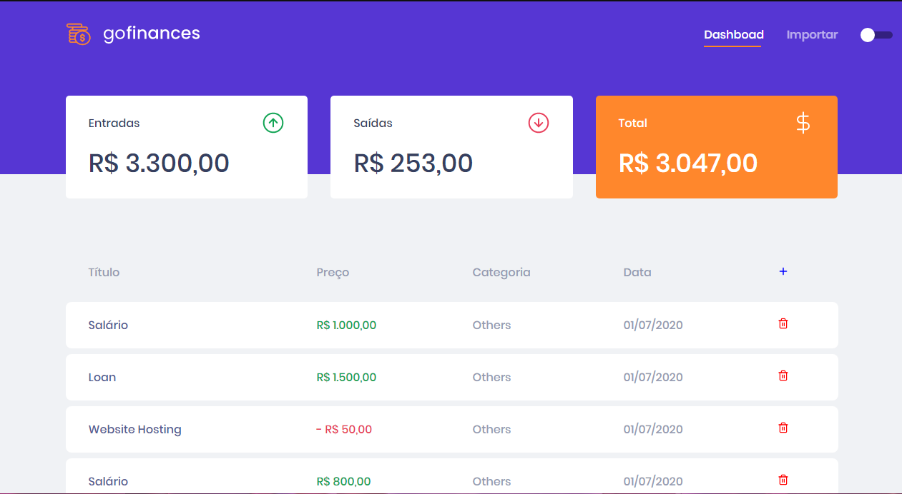
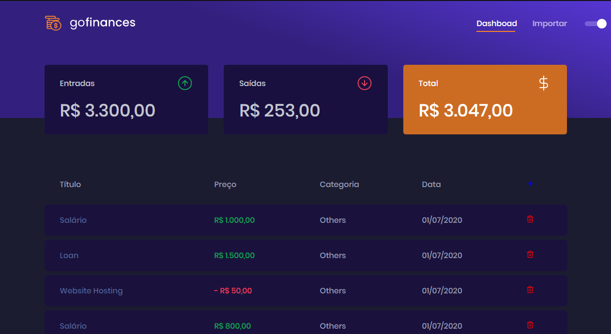
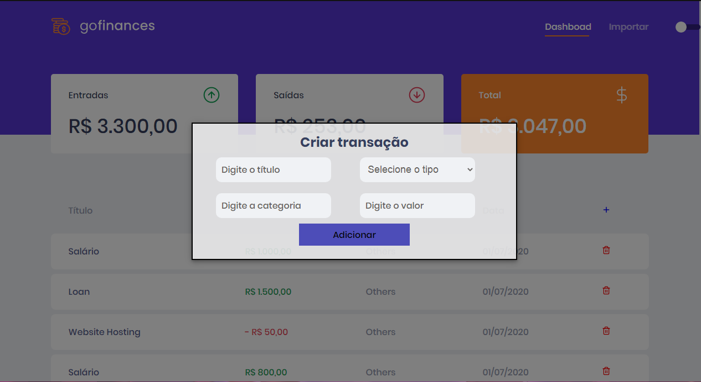
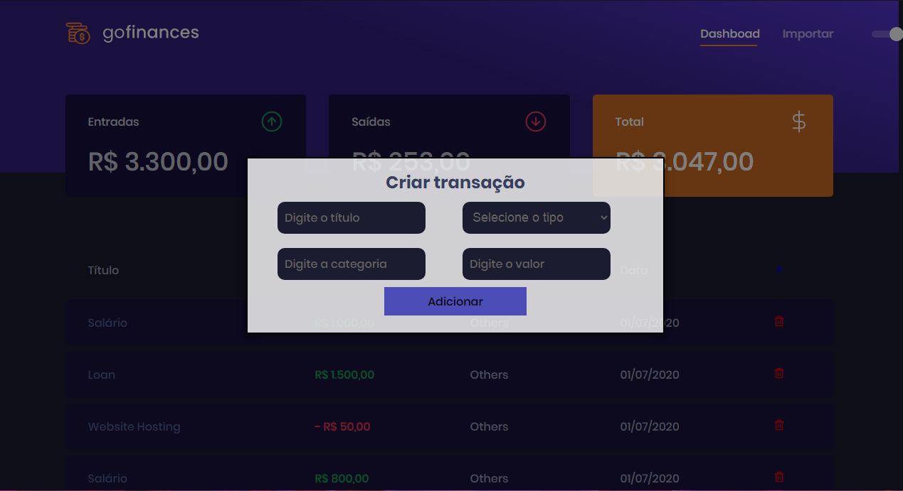
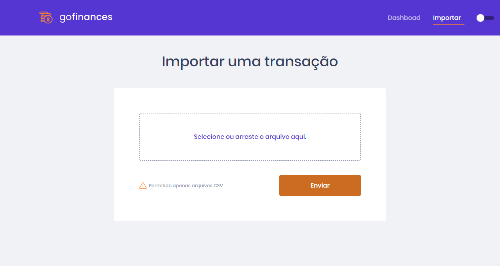
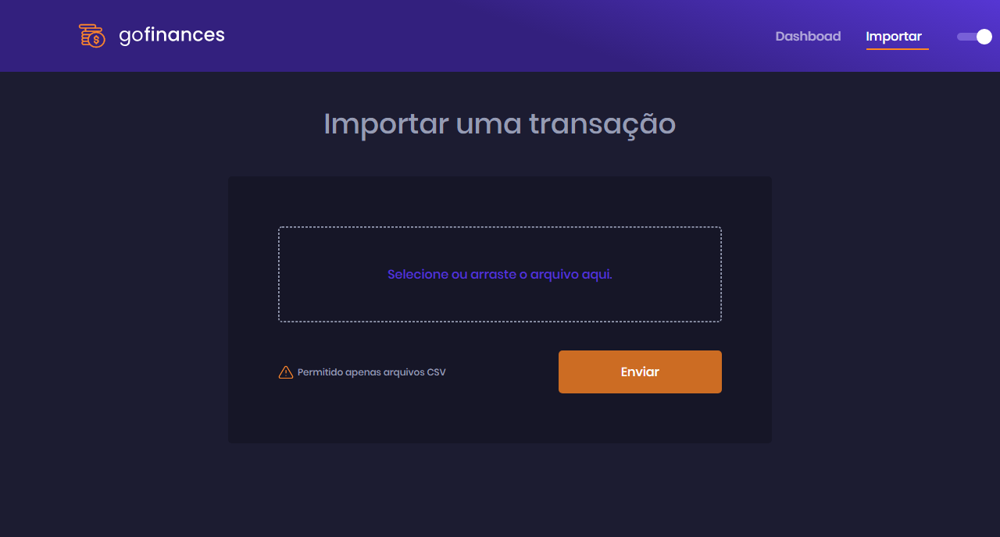
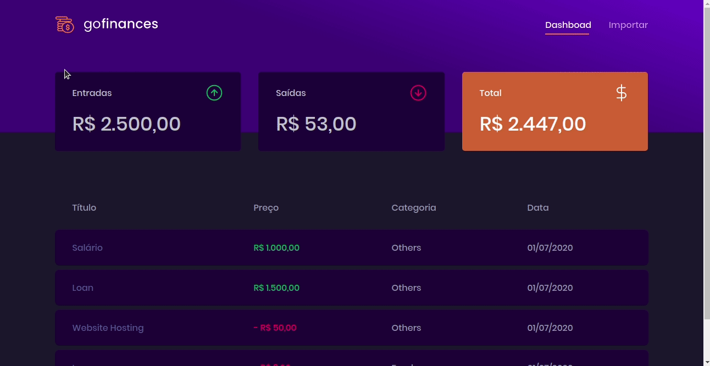
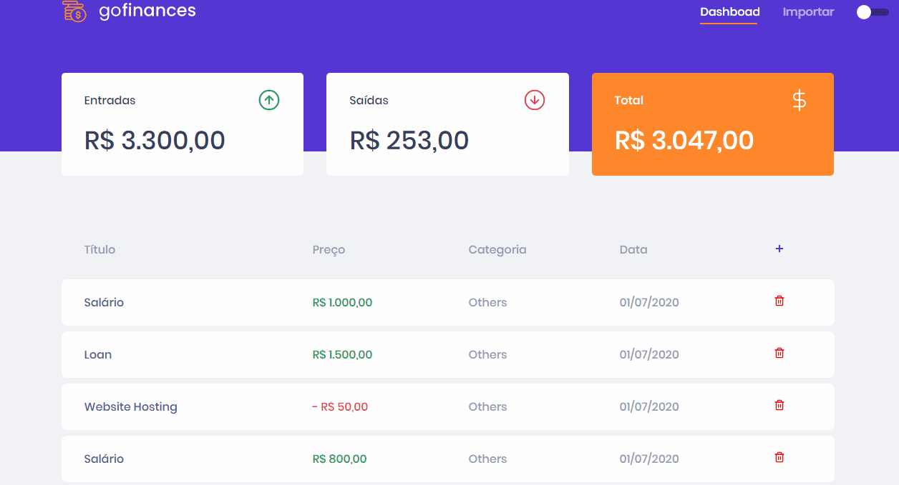

# 🚀 GoFinances

## 🔖 Sobre

GoFinances é uma aplicação de gestão de transações, consumindo a Api do backend

<h1>Funcionalidades</h1>
<ul>
  <li>Listar as transações, junto de suas informações.</li>
  <li>Importar um arquivo CSV para criar novas transações.</li>
  <li>Adicionei um botão que abre um modal para criar uma nova transação.</li>
  <li>Adicionei um botão para deletar um transação.</li>
</ul>

## 📷 Screenshot:

  💻 Adicionei um tema light/dark, o tema usado antes de fechar a página fica salvo para a próxima vez.

    
    
    
    
    
    
    
    

# 🚀 Tecnologias
<ul>
    <li>✔️ NodeJS</li>
    <li>✔️ ReactJS</li>
    <li>✔️ TypeScript</li>
    <li>✔️ TypeORM</li>
    <li>✔️ PostgreSQL</li>
    <li>✔️ Styled Components</li>
    <li>✔️ React Hooks</li>
    <li>✔️ Context Api</li>
    <li>✔️ Multer</li>
    <li>✔️ Express</li>
</ul>

<h2><a href="https://github.com/PedroLucasSS/GoFinances">Clique aqui para conferir o Frontend</a></h2>

#

<h3 align="center"> Made with 💜 by <a href="https://www.linkedin.com/in/pedro-lucas-4b2941199/">Pedro Lucas</a></h3>
